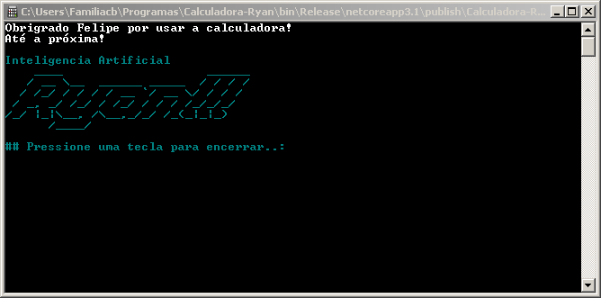

# Calculadora-Ryan
É uma calculadora de inteligencia artificial que pode realizar operações com as quatros operações da aritmética e outras.

## Exemplo

```
Inteligencia Artificial
    ____                    ______
   / __ \__  ______ _____  / / / /
  / /_/ / / / / __ `/ __ \/ / / /
 / _, _/ /_/ / /_/ / / / /_/_/_/
/_/ |_|\__, /\__,_/_/ /_(_|_|_)
      /____/

## Pressione uma tecla para encerrar..:
```

## _Screenshot_



## _Download_

[📥 Download do arquivo .zip](Dist/Calculadora-Ryan.zip.zip)

Baixe o arquivo abaixo. Descompate na pasta desejada.

Execute utilizando o comando:

```
---- dotnet Escala-Musical.dll ----
```

Ou se estiver no Windows, de um duplo-click no programa ou clique com o botão direito do mouse, e depois clique em Executar como Administrador.

## _Complementos para instalação do Programa_

[📥 Download do Winrar .zip (3.09 MB)](Winrar/winrar-5-91.exe)

## _Agradecimentos_

- [Figgle](https://github.com/drewnoakes/figgle)
- [Etec Adolpho Berezin](http://eteab.com.br/cms/)
- [Felipe Barbosa](https://github.com/LipeClash?tab=repositories)
- [Prof. Ermogenes Palacio](https://github.com/ermogenes/aulas-programacao-csharp)
- [Prof. Diego Neri](https://github.com/diegoneri)
- [Matheus Khairallah](https://github.com/MatheusKhairallah?tab=repositories)

---

                                                         Todos os direitos reservados.
